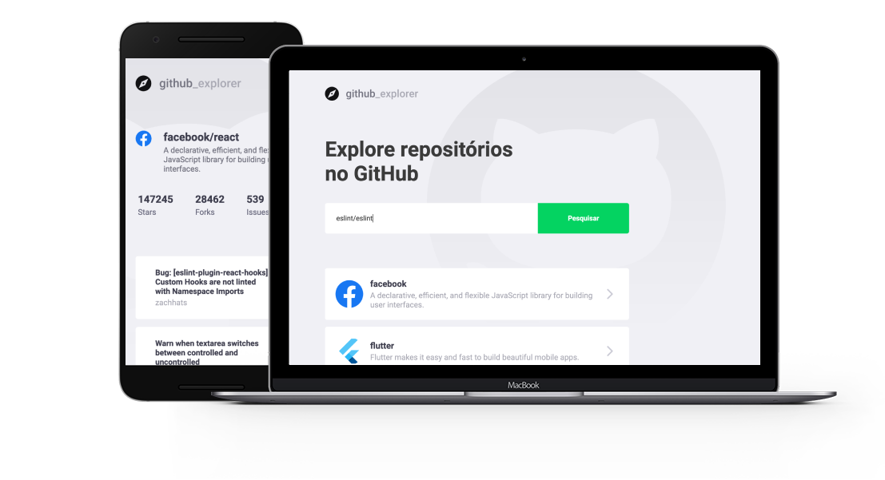

<h1 align="center">
  GitHub Explorer
</h1>

<h1 align="center">
  
</h1>

  

  

  

## :question: About

Application to explore GitHub repository issues built with React.js and TypeScript.This project was made to apply my studies in:
- React.js
- React Hooks
- Git and Github
- Responsive layout and styled-components.

[Demo](https://leon-carvalho.github.io/github-explorer/#/)

## :running: Running

- clone or download this repo
- open project with terminal/cmd and type: `yarn` or `npm install` to install dependencies
- run: `yarn start` or `npm run start` to run project in `localhost:3000` if this port is available

## :books: Techs and Libs

- axios
- polished
- typescript
- react-icons
- styled-components
- eslint, prettier and editorConfig (code linting and styling)

## :memo: Todo

- Tests [ ]
- Animations [ ]
